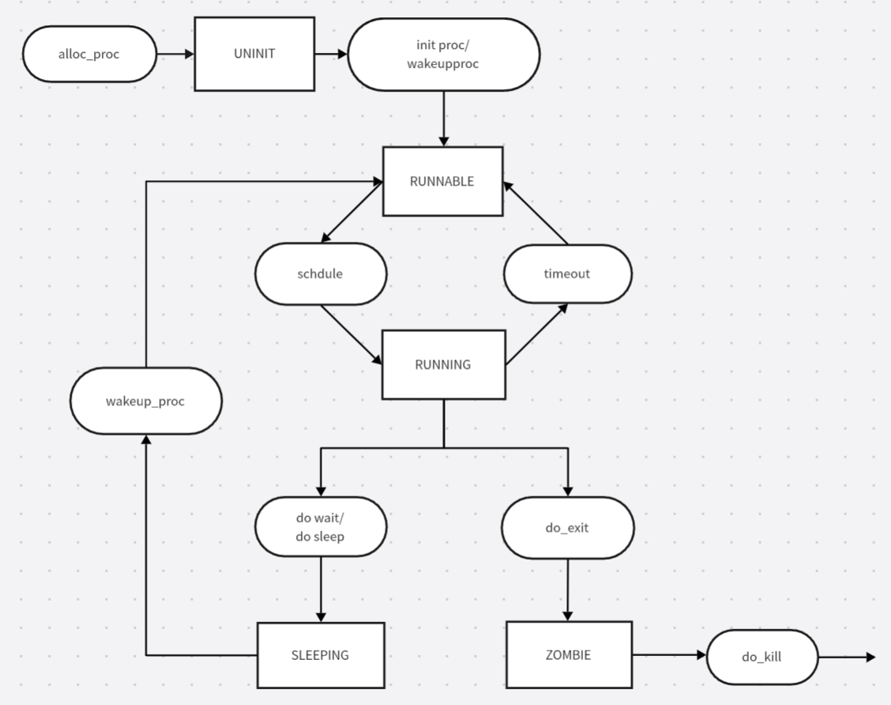

#### 练习1：加载应用程序并执行（需要编码）
do_execv函数调用load_icode（位于kern/process/proc.c中）来加载并解析一个处于内存中的ELF执行文件格式的应用程序。你需要补充load_icode的第6步，建立相应的用户内存空间来放置应用程序的代码段、数据段等，且要设置好proc_struct结构中的成员变量trapframe中的内容，确保在执行此进程后，能够从应用程序设定的起始执行地址开始执行。需设置正确的trapframe内容。

请在实验报告中简要说明你的设计实现过程。

请简要描述这个用户态进程被ucore选择占用CPU执行（RUNNING态）到具体执行应用程序第一条指令的整个经过。

##### 1.1 
首先我们对位于kern/process/proc.c 中的load_icode 函数进行续写，完成第六步设置中断帧的过程。确保要运行的应用程序能正确加载到进程空间，中断返回后进入U mode并从应用程序起始地址开始执行.

共需三步：

1.在用户程序运行时，为了正确地访问栈，需要将Trap Frame（tf）中的栈顶指针（sp）设置为用户栈的顶部地址（USTACKTOP）。

2.此外，为了确保用户程序能够从正确的位置开始执行，需要将Trap Frame中的程序计数器（epc）设置为ELF文件头中定义的入口点地址（e_entry）。这个ELF文件头是通过struct elfhdr *elf = (struct elfhdr *)binary;方式定义的二进制ELF文件的文件头。

3.在设置处理器状态信息时，需要考虑两个状态位：SPP和SPIE。

SPP（Previous Privilege Mode）：用于表示处理器在发生异常或中断之前的特权级别。值为0表示处理器在异常或中断前处于用户模式（User Mode），值为1表示处于特权模式（Supervisor Mode）。由于在系统调用sys_exec之后，我们会在trap返回时使用sret指令，而sret指令会根据SPP的值返回到中断前的状态。因此，为了确保在用户态发生中断后能够通过sret返回到用户模式，SPP应设置为0。

SPIE（Previous Interrupt Enable）：用于表示处理器在发生异常或中断之前的中断使能状态。值为0表示中断被禁用，值为1表示中断被启用。为了确保用户态能够正常触发中断，SPIE应设置为1。

```
    // Set the user stack top
    tf->gpr.sp = USTACKTOP;
    // Set the entry point of the user program
    tf->epc = elf->e_entry;
    // Set the status register for the user program
    tf->status = (read_csr(sstatus) & ~SSTATUS_SPP) | SSTATUS_SPIE;
```

##### 1.2 请简要描述这个用户态进程被ucore选择占用CPU执行（RUNNING态）到具体执行应用程序第一条指令的整个经过。


当操作系统调度器从就绪进程队列中选择一个就绪进程后，通过执行进程切换操作，使得该被选中的就绪进程得以运行。然而，在此之前，还需要进行一些准备工作，包括配置中断帧等，以确保进程能够正确地开始执行,具体如下：

1. **准备加载新的执行代码**  
   在加载新的执行代码之前，需要清空用户态内存空间，这一过程由`do_execve`函数实现。在此过程中，会对`mm`（内存管理结构）进行判断：
   - 如果`mm`不为空，说明当前是一个用户进程，此时需要将页表设置为内核空间页表，以便切换到内核态。
   - 如果`mm`的引用数为1，表示只有当前进程在使用这块内存。如果该进程结束后，其所占用的用户空间内存和进程页表将不再被其他进程使用，因此这些资源应当被释放，以便其他进程能够有效利用有限的内存资源。

2. **加载应用程序执行代码并建立用户环境**  
   这一步骤包括读取ELF格式的文件、申请内存空间、建立用户态虚拟内存空间以及加载应用程序的执行代码，主要由`load_icode`函数实现。具体操作如下：
   - 调用`mm_create`函数为进程的内存管理数据结构`mm`申请内存空间，并对其进行初始化。
   - 调用`setup_pgdir`函数申请一个页目录表所需的内存空间，并将内核页表的内容复制到新目录表中，以确保能够正确映射内核虚拟空间。
   - 解析ELF格式的执行程序，根据程序中各个段的起始位置和大小，调用`mm_map`函数建立对应的`vma`（虚拟内存区域）结构，并将其插入到`mm`结构中，从而定义用户进程的合法用户态虚拟地址空间。
   - 分配物理内存空间，并在页表中建立虚拟地址与物理地址的映射关系，然后将执行程序的各个段内容复制到相应的内核虚拟地址中。
   - 调用`mm_map`函数设置用户栈，建立用户栈的`vma`结构，明确用户栈位于用户虚拟空间的顶端，大小为256个页（即1MB），并分配物理内存，建立栈的虚拟地址与物理地址的映射关系。

3. **更新用户进程的虚拟内存空间**  
   将`mm->pgdir`赋值到`cr3`寄存器中，从而更新用户进程的虚拟内存空间。

4. **建立进程的执行现场**  
   清空进程的中断帧，并重新设置中断帧，以确保在执行中断返回指令“iret”后，CPU能够切换到用户态特权级，回到用户态内存空间，使用用户态的代码段、数据段和堆栈，并跳转到用户进程的第一条指令执行。同时，确保在用户态下能够正常响应中断。
  

#### 练习2：为父进程复制自己的内存空间给子进程（需要编码）
创创建子进程的函数do_fork在执行中将拷贝当前进程（即父进程）的用户内存地址空间中的合法内容到新进程中（子进程），完成内存资源的复制。具体是通过copy_range函数（位于kern/mm/pmm.c中）实现的，请补充copy_range的实现，确保能够正确执行。

请在实验报告中简要说明你的设计实现过程。
 - 如何设计实现Copy on Write机制？给出概要设计，鼓励给出详细设计。

 	```
            * (1) find src_kvaddr: the kernel virtual address of page
             * (2) find dst_kvaddr: the kernel virtual address of npage
             * (3) memory copy from src_kvaddr to dst_kvaddr, size is PGSIZE
             * (4) build the map of phy addr of  nage with the linear addr start
             */
            //1.找寻父进程的内核虚拟页地址
            void * kva_src = page2kva(page);
            //2.找寻子进程的内核虚拟页地址   
            void * kva_dst = page2kva(npage);
            //3.复制父进程内容到子进程 
            memcpy(kva_dst, kva_src, PGSIZE);
            //4.建立物理地址与子进程的页地址起始位置的映射关系
            ret = page_insert(to, npage, start, perm);
	```
回答：找到父子进程的内核虚拟地址，然后拷贝父进程的到子进程中，最后为子进程当前分配这一物理页映射上对应的在子进程虚拟地址空间里的一个虚拟页。
回答：给新对象一个指针指向内存，该页面设置为只读，在对这段内容进行写操作时候便会引发Page Fault，这时候我们便知道这段内容是需要去写的，然后重新为进程分配页面、拷贝页面内容、建立映射关系
#### 练习3：阅读分析源代码，理解进程执行 fork/exec/wait/exit 的实现，以及系统调用的实现（不需要编码）
##### fork
fork的调用过程这样的：调用fork函数，进入正常的中断处理机制，然后fork调用SYS_fork函数，之后调用do_fork。

do_fork函数调用alloc_proc函数分配并初始化进程控制块，之后用setup_stack函数分配并初始化内核栈，为内核进程（线程）建立栈空间，再用copy_mm函数根据 clone_flag 标志复制或共享进程内存管理结构。之后用copy_thread 函数设置进程在内核（将来也包括用户态）正常运行和调度所需的中断帧和执行上下文。最后为进程分配一个 PID（get_pid函数），把设置好的进程控制块放入hash_list和proc_list两个全局进程链表中。自此，进程已经准备好执行了，把进程状态设置为“就绪”态，并且设置返回码为子进程的 PID 号。

fork不会影响当前进程的执行状态，但是会将子进程的状态标记为RUNNALB，使得可以在后续的调度中运行起来；

**用户态：** 进程通过fork系统调用请求创建一个新的子进程。
**内核态：** 操作系统接管，创建一个与父进程几乎完全相同的新进程（除了PID和一些其他属性）。这涉及到复制父进程的地址空间、资源等。
**返回用户态：** fork调用返回，在父进程中返回子进程的PID，在子进程中返回0。

##### exec
该函数通过SYS_exec调用do_execve来进行实现。首先为加载新的执行码做好用户态内存空间清空准备。如果mm不为NULL，则设置页表为内核空间页表，且进一步判断mm的引用计数减1后是否为0，如果为0，则表明没有进程再需要此进程所占用的内存空间，为此将根据mm中的记录，释放进程所占用户空间内存和进程页表本身所占空间。最后把当前进程的mm内存管理指针为空。接下来是加载应用程序执行码到当前进程的新创建的用户态虚拟空间中。之后就是调用load_icode从而使之准备好执行。

exec不会影响当前进程的执行状态，但是会修改当前进程中执行的程序；

**用户态：** 进程决定要执行一个新的程序，并调用exec系列系统调用之一。
**内核态：** 操作系统接手，加载新的程序映像到当前进程的地址空间，覆盖当前进程的映像，但保留进程的PID和其他属性。
**返回用户态：** 如果exec调用成功，当前进程的代码、数据、堆栈等被新程序的对应部分替换，开始执行新程序的main函数，原有程序不再执行。exec调用本身不返回；如果调用失败，它会返回到原有程序。

##### wait
wait的调用和exec很像，也是通过SYS_wait调用do_wait进行的。do_wait首先检查用于保存返回码的code_store指针地址位于合法的范围内，然后根据PID找到需要等待的子进程PCB，循环询问正在等待的子进程的状态，直到有子进程状态变为ZOMBIE；如果没有需要等待的子进程，那么返回E_BAD_PROC；如果子进程正在可执行状态中，那么将当前进程休眠，在被唤醒后再次尝试。

wait系统调用取决于是否存在可以释放资源（ZOMBIE）的子进程，如果有的话不会发生状态的改变，如果没有的话会将当前进程置为SLEEPING态，等待执行了exit的子进程将其唤醒；

**用户态：** 父进程调用wait来等待子进程终止。
**内核态：** 操作系统挂起调用wait的父进程，直到一个子进程终止。
**返回用户态：** 当子进程终止时，wait调用返回，并允许父进程继续执行。返回值包含了子进程的终止状态。

##### exit
最后一个exit也是通过SYS_exit直接调用的。do_exit函数是这样运行的：
先释放进程的虚拟内存空间，然后设置当期进程状态为PROC_ZOMBIE即标记为僵尸进程。如果父进程处于等待当期进程退出的状态，则将父进程唤醒；如果当前进程有子进程，则将子进程设置为initproc的子进程，并完成子进程中处于僵尸状态的进程的最后的回收工作。最后主动调用调度函数进行调度，选择新的进程去执行。

exit会将当前进程的状态修改为ZOMBIE态，并且会将父进程唤醒（修改为RUNNABLE），然后主动让出CPU使用权；

**用户态：** 进程调用exit来终止自己。
**内核态：** 操作系统接管，释放进程所拥有的资源，并通知父进程（如果父进程正在等待）。
**返回用户态：** exit调用后，进程不会返回到用户态，因为它已经终止了。

##### 系统调用
在syscall.c中定义了许多系统调用函数，包括sys_exit、sys_fork、sys_wait、sys_exec等。syscall是内核程序为用户程序提供内核服务的一种方式。在中断处理例程中，程序会根据中断号，执行syscall函数（注意该syscall函数为内核代码，非用户库中的syscall函数）。内核syscall函数会一一取出六个寄存器的值，并根据系统调用号来执行不同的系统调用。而那些系统调用的实质就是其他内核函数的wrapper。

内核态与用户态程序交错执行的过程如下：

- 系统调用：当用户程序执行一个系统调用时，CPU从用户态切换到内核态。这通常通过触发一个中断来实现。
中断处理：操作系统接管，执行系统调用对应的内核函数（trapentry.S）。
- 返回用户态：当系统调用完成后，操作系统保存结果，并通过特殊的指令（如iret）将CPU切换回用户态，程序从系统调用之后的指令继续执行。

内核态执行结果返回给用户程序的方式：
- 系统调用的返回值通常通过CPU的寄存器传递。例如，在x86架构中，eax寄存器用于存储fork、exec和wait系统调用的返回值。
如果系统调用有多个返回值或输出参数，它们可能通过用户空间提供的缓冲区来传递。
在系统调用完成后，程序从系统调用点之后继续执行，此时可以检查寄存器或缓冲区以获取内核态执行的结果。

##### 执行状态生命周期图

#### 扩展练习 Challenge：

- 实现 Copy on Write （COW）机制
  给出实现源码,测试用例和设计报告（包括在cow情况下的各种状态转换（类似有限状态自动机）的说明）。
  这个扩展练习涉及到本实验和上一个实验“虚拟内存管理”。在ucore操作系统中，当一个用户父进程创建自己的子进程时，父进程会把其申请的用户空间设置为只读，子进程可共享父进程占用的用户内存空间中的页面（这就是一个共享的资源）。当其中任何一个进程修改此用户内存空间中的某页面时，ucore会通过page fault异常获知该操作，并完成拷贝内存页面，使得两个进程都有各自的内存页面。这样一个进程所做的修改不会被另外一个进程可见了。请在ucore中实现这样的COW机制。
  由于COW实现比较复杂，容易引入bug，请参考 https://dirtycow.ninja/ 看看能否在ucore的COW实现中模拟这个错误和解决方案。需要有解释。
  这是一个big challenge.

- 说明该用户程序是何时被预先加载到内存中的？与我们常用操作系统的加载有何区别，原因是什么？
